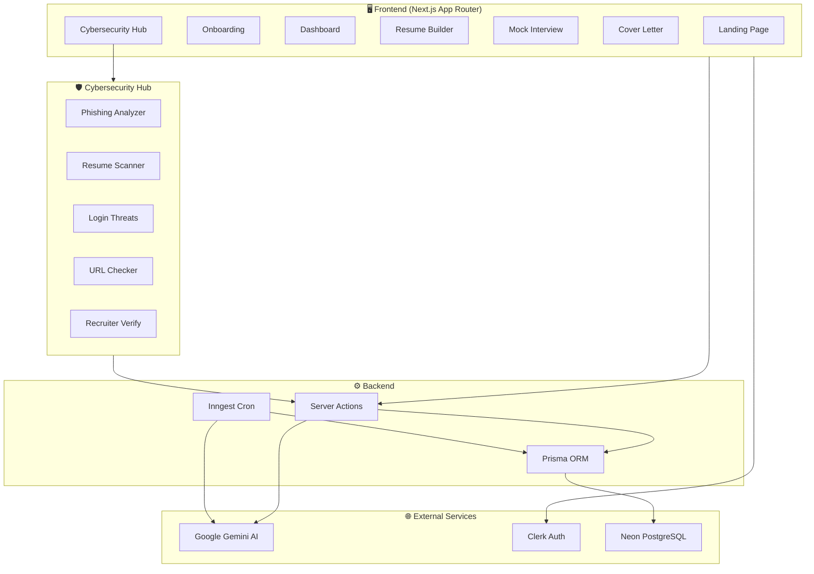
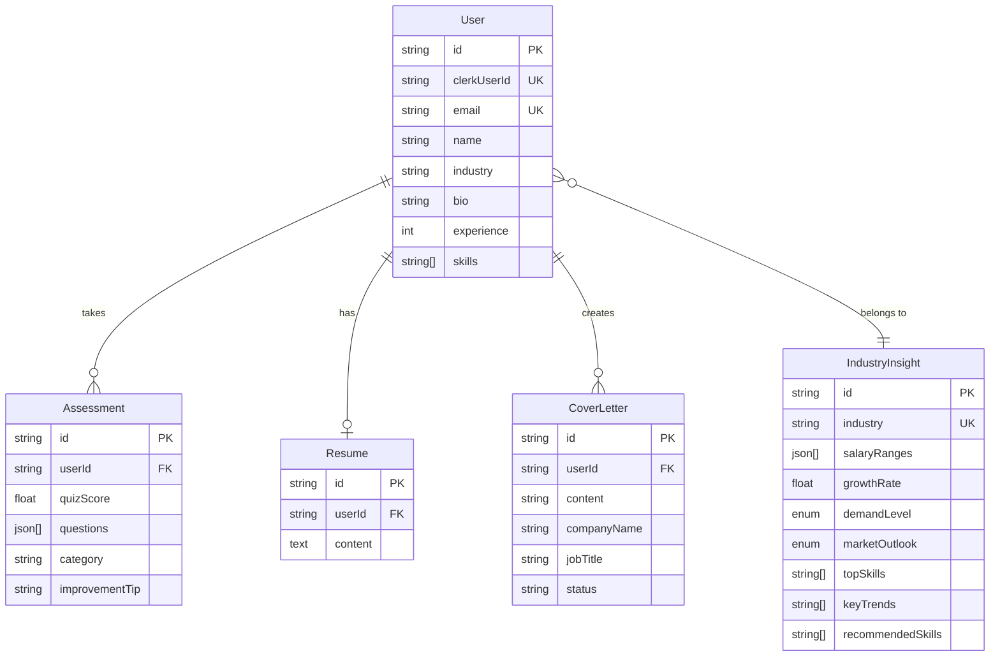

<div align="center">

# 🚀 CareerForgeAI

### *Your AI-Powered Career Coach + Cybersecurity Shield*

[](https://nextjs.org/)
[](https://react.dev/)
[](https://tailwindcss.com/)
[](https://www.prisma.io/)
[](https://ai.google.dev/)
[](https://clerk.dev/)

**CareerForgeAI** is a full-stack SaaS platform that combines **AI-powered career tools** with a built-in **Cybersecurity Hub** — helping job seekers build resumes, ace interviews, generate cover letters, and **stay protected** from phishing, scams, and data breaches.

[🌐 Live Demo](https://career-forge-ai-blond.vercel.app) · [🐛 Report Bug](https://github.com/Manvendra0023/CareerForgeAI/issues) · [✨ Request Feature](https://github.com/Manvendra0023/CareerForgeAI/issues)

</div>

---

## 📑 Table of Contents

- [✨ Key Features](#-key-features)
- [🛡️ Cybersecurity Hub — 5 AI-Powered Tools](#️-cybersecurity-hub--5-ai-powered-tools)
- [🧩 Tech Stack](#-tech-stack)
- [📐 Architecture](#-architecture)
- [🖥️ Screenshots](#️-screenshots)
- [⚙️ Getting Started](#️-getting-started)
- [📁 Project Structure](#-project-structure)
- [🗄️ Database Schema](#️-database-schema)
- [🤝 Contributing](#-contributing)
- [📜 License](#-license)

---

## ✨ Key Features

<table>
<tr>
<td width="50%">

### 📝 AI Resume Builder
- Form-based **structured resume creation** (contact, summary, skills, experience, education, projects)
- Real-time **Markdown preview** with MDEditor
- **One-click PDF export** via html2pdf.js
- Built-in **Resume Security Scanner** to check for overshared personal data

</td>
<td width="50%">

### 🎯 AI Mock Interview Engine
- Generates **role-specific quiz questions** using Google Gemini
- **5 questions per quiz** tailored to your industry & skills
- Instant **explanations** for every answer
- **Performance analytics** with score tracking via Recharts

</td>
</tr>
<tr>
<td width="50%">

### 💼 AI Cover Letter Generator
- Input **company name, job title & description**
- AI generates a **personalized, professional cover letter**
- **Save, edit, and manage** multiple cover letters
- Validated with **React Hook Form + Zod**

</td>
<td width="50%">

### 📊 Dynamic Industry Insights Dashboard
- **Market outlook** (Positive / Neutral / Negative)
- **Salary range charts** by role (min, median, max)
- **Growth rate, demand level & top skills**
- **Auto-updated weekly** via Inngest cron jobs + Gemini AI

</td>
</tr>
<tr>
<td width="50%">

### 🧑‍💻 Personalized Onboarding
- Select your **industry & sub-industry**
- Add **skills, experience level & bio**
- All AI features are **personalized** based on your profile

</td>
<td width="50%">

### 🔐 Clerk Authentication
- **Sign up / Sign in** with email, Google, or GitHub
- **Protected routes** via Next.js middleware
- **User profile sync** with Prisma database

</td>
</tr>
</table>

---

## 🛡️ Cybersecurity Hub — 5 AI-Powered Tools

> *"1 in 3 job seekers get scammed. 68% of resumes overshare personal data."*

The **Cybersecurity Hub** is a dedicated section with **5 AI-powered security tools** designed to protect job seekers from online threats during their job search.

<table>
<tr>
<th width="5%">#</th>
<th width="25%">Tool</th>
<th width="45%">What It Does</th>
<th width="25%">Key Output</th>
</tr>
<tr>
<td>🟣</td>
<td><strong>Phishing Email Analyzer</strong></td>
<td>Paste a suspicious job offer email — AI detects scam patterns, fake recruiter tactics, and suspicious sender domains</td>
<td>Risk Score (0-100), Red Flags, Trust Signals, Verdict & Recommendation</td>
</tr>
<tr>
<td>🔵</td>
<td><strong>Resume Security Scanner</strong></td>
<td>Paste your resume — AI checks for overshared personal data (addresses, DOB, IDs) and identity theft risks</td>
<td>Safety Score, Flagged Data Points, Priority Fixes</td>
</tr>
<tr>
<td>🔴</td>
<td><strong>Login Threat Detection</strong></td>
<td>Enter your email — AI checks for data breach exposure, credential risks, and domain-level threats with a live progress bar</td>
<td>Threat Score (0-100), Breach Info, Domain Risk, Security Tips</td>
</tr>
<tr>
<td>🔷</td>
<td><strong>URL Safety Checker</strong></td>
<td>Paste a suspicious link — AI checks for phishing, malware risks, domain age, and typosquatting</td>
<td>Risk Score (0-100), Red Flags, Safe Signals, Verdict</td>
</tr>
<tr>
<td>🟡</td>
<td><strong>Fake Recruiter Verification</strong></td>
<td>Input recruiter name, company, email, LinkedIn, and message — AI cross-references data to verify legitimacy</td>
<td>Trust Score (0-100), Trust Level (Scam → Legitimate), Next Steps</td>
</tr>
</table>

Each tool features:
- 🎯 **AI-powered analysis** using Google Gemini
- 📊 **Animated progress bars** with step-by-step status
- 🏷️ **Color-coded risk levels** (Safe → Low → Medium → High)
- 💡 **Actionable recommendations** on what to do next

---

## 🧩 Tech Stack

<table>
<tr>
<th>Layer</th>
<th>Technology</th>
<th>Purpose</th>
</tr>
<tr>
<td rowspan="5"><strong>Frontend</strong></td>
<td>Next.js 15 (App Router + Turbopack)</td>
<td>React framework with server components</td>
</tr>
<tr>
<td>React 19</td>
<td>UI library</td>
</tr>
<tr>
<td>Tailwind CSS 4</td>
<td>Utility-first styling</td>
</tr>
<tr>
<td>ShadCN UI + Radix UI</td>
<td>Accessible, beautiful component library</td>
</tr>
<tr>
<td>Recharts</td>
<td>Salary & performance data visualization</td>
</tr>
<tr>
<td rowspan="4"><strong>Backend</strong></td>
<td>Next.js Server Actions</td>
<td>Serverless API endpoints</td>
</tr>
<tr>
<td>Prisma ORM</td>
<td>Type-safe database access</td>
</tr>
<tr>
<td>Neon PostgreSQL</td>
<td>Serverless database</td>
</tr>
<tr>
<td>Inngest</td>
<td>Background jobs & weekly cron tasks</td>
</tr>
<tr>
<td rowspan="2"><strong>AI</strong></td>
<td>Google Gemini API</td>
<td>Resume writing, interview Q&A, cover letters, security analysis</td>
</tr>
<tr>
<td>@google/genai SDK</td>
<td>Gemini API client</td>
</tr>
<tr>
<td rowspan="2"><strong>Auth</strong></td>
<td>Clerk</td>
<td>Authentication & user management</td>
</tr>
<tr>
<td>Next.js Middleware</td>
<td>Route protection</td>
</tr>
<tr>
<td rowspan="3"><strong>Utilities</strong></td>
<td>React Hook Form + Zod</td>
<td>Form validation</td>
</tr>
<tr>
<td>MDEditor</td>
<td>Markdown resume editor</td>
</tr>
<tr>
<td>html2pdf.js</td>
<td>Client-side PDF generation</td>
</tr>
</table>

---

## 📐 Architecture



---

## ⚙️ Getting Started

### Prerequisites

- **Node.js** 18+ installed
- **npm** or **yarn**
- A [Neon](https://neon.tech) PostgreSQL database
- A [Clerk](https://clerk.dev) account
- A [Google Gemini](https://ai.google.dev) API key
- An [Inngest](https://www.inngest.com) account (optional, for cron jobs)

### 1️⃣ Clone the Repository

```bash
git clone https://github.com/Manvendra0023/CareerForgeAI.git
cd CareerForgeAI/project
```

### 2️⃣ Install Dependencies

```bash
npm install
```

### 3️⃣ Configure Environment Variables

Create a `.env` file inside the `project/` directory:

```env
# Database
DATABASE_URL=your_neon_postgresql_url

# Clerk Authentication
NEXT_PUBLIC_CLERK_PUBLISHABLE_KEY=your_clerk_publishable_key
CLERK_SECRET_KEY=your_clerk_secret_key
NEXT_PUBLIC_CLERK_SIGN_IN_URL=/sign-in
NEXT_PUBLIC_CLERK_SIGN_UP_URL=/sign-up
NEXT_PUBLIC_CLERK_AFTER_SIGN_IN_URL=/onboarding
NEXT_PUBLIC_CLERK_AFTER_SIGN_UP_URL=/onboarding

# Google Gemini AI
GEMINI_API_KEY=your_gemini_api_key

# Inngest (for weekly cron jobs)
INNGEST_SIGNING_KEY=your_inngest_signing_key
```

### 4️⃣ Set Up the Database

```bash
npx prisma generate
npx prisma migrate dev
```

### 5️⃣ Run the Dev Server

```bash
npm run dev
```

Open [http://localhost:3000](http://localhost:3000) in your browser 🎉

---

## 📁 Project Structure

```
CareerForgeAI/
└── project/
    ├── app/
    │   ├── (auth)/                     # Auth pages (sign-in, sign-up)
    │   ├── (main)/
    │   │   ├── ai-cover-letter/        # Cover letter generator & list
    │   │   ├── cybersecurity/          # 🛡️ Cybersecurity Hub landing
    │   │   ├── interview/              # Mock interview quiz & results
    │   │   ├── onboarding/             # User onboarding form
    │   │   ├── resume/                 # Resume builder + security scanner
    │   │   ├── phishing-analyzer/      # 🟣 Phishing email analyzer
    │   │   ├── resume-security-scanner/# 🔵 Resume security scanner
    │   │   ├── login-threat-detection/ # 🔴 Login threat detection
    │   │   ├── url-safety-checker/     # 🔷 URL safety checker
    │   │   └── recruiter-verification/ # 🟡 Fake recruiter verifier
    │   ├── dashboard/                  # Industry insights dashboard
    │   ├── api/inngest/                # Inngest webhook endpoint
    │   └── lib/                        # Helpers & Zod schemas
    ├── actions/                        # Server actions (AI logic)
    │   ├── resume.js                   # Resume + phishing analysis
    │   ├── interview.js                # Quiz generation & scoring
    │   ├── cover-letter.js             # Cover letter generation
    │   ├── security.js                 # 🛡️ All 5 cybersecurity tools
    │   ├── dashboard.js                # Industry insights
    │   └── user.js                     # User management
    ├── components/                     # Shared UI components
    │   ├── ui/                         # ShadCN UI primitives
    │   ├── header.jsx                  # Navigation header
    │   └── HeroSection.jsx             # Landing page hero
    ├── data/                           # Static data (features, FAQs, etc.)
    ├── hooks/                          # Custom React hooks
    ├── lib/                            # Prisma client, utils, Inngest
    └── prisma/                         # Database schema & migrations
```

---

## 🗄️ Database Schema



---

## 🤝 Contributing

Contributions are welcome! Here's how to get started:

1. **Fork** the repository
2. **Create** a feature branch (`git checkout -b feature/amazing-feature`)
3. **Commit** your changes (`git commit -m 'Add amazing feature'`)
4. **Push** to the branch (`git push origin feature/amazing-feature`)
5. **Open** a Pull Request

---

## 📜 License

This project is open source and available under the [MIT License](LICENSE).

---

<div align="center">

**Built with ❤️ by [Manvendra Kumar](https://github.com/Manvendra0023)**

⭐ **Star this repo if you find it helpful!** ⭐

</div>
